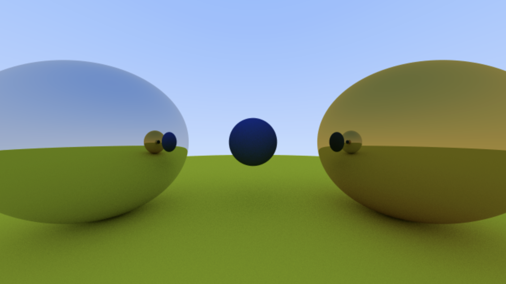

# react-raytracer

An implementation of Peter Shirley's [_Ray Tracing in One Weekend_](https://raytracing.github.io/books/RayTracingInOneWeekend.html), written in React.



## Getting Started

### Prerequisites

-   Node.js (>= 16.x)
-   npm or yarn

### Installation

Clone the repository:

```bash
git clone https://github.com/connorms/react-raytracer.git
cd react-raytracer
```

Install the dependencies:

```bash
npm install
```

## Running the Project

To start the development server:

```bash
npm run dev
```
